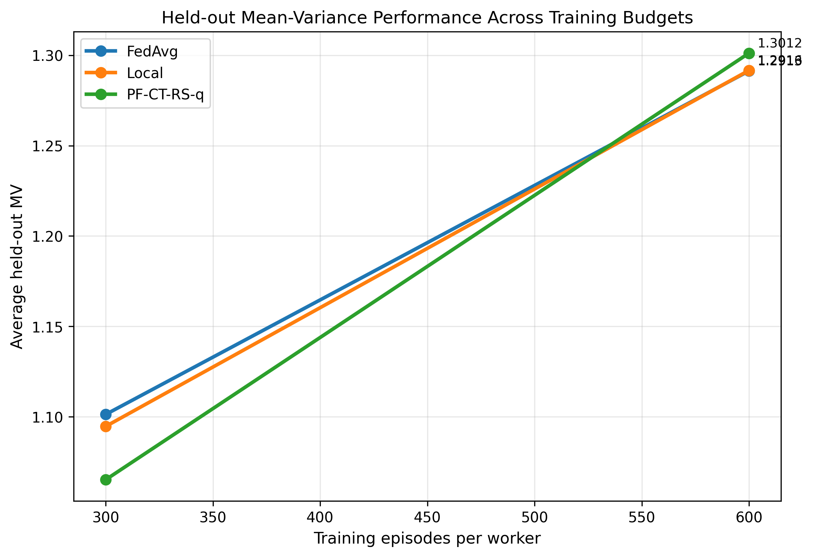

# Federated Risk-Sensitive Q-Learning in Continuous Time

Reproduction and federated/decentralized extension of:

> Xie (2025). *Risk-Sensitive Q-Learning in Continuous Time with Application to Dynamic Portfolio Selection.* NeurIPS 2025 Workshop. [arXiv:2512.02386](https://arxiv.org/abs/2512.02386)

DDLS course project, Universität Bern, Spring 2026.

---

## Overview

This repo reproduces the paper's main results (Table 1, Figure 1, Figure 2) and extends CT-RS-q to federated and decentralized settings across heterogeneous financial markets.

**Three phases:**
- **Phase 1 (done):** Reproduce the single-agent continuous-time risk-sensitive q-learning results.
- **Phase 2 (done):** Federated extension — Local / FedAvg / PF-CT-RS-q across 4 heterogeneous worker markets with different dynamics and risk preferences.
- **Phase 3 (planned):** Decentralized extension — gossip-based consensus on ring and fully-connected topologies, no central server.

---

## Phase 1 Results

| Policy | Cum Return | Std Dev | MV | vs Paper MV |
|---|---|---|---|---|
| Baseline (a=0.5) | 0.221 | 0.095 | 1.217 | +0.0% |
| Optimal (B.1 closed form) | 0.709 | 0.720 | 1.450 | −0.2% |
| CT-RS-q (learned) | 0.729 | 0.791 | 1.416 | −1.5% |

MV objective reproduced within 1.5% of the paper. Baseline and Optimal within Monte Carlo noise.

**Key finding:** The B.2 parameterization has a structural non-identifiability — `ψ_ce1` and `ψ_ce2` enter the q-function loss only through their difference. Individual parameter convergence is impossible; the identified combination `(ψ_ce1 − ψ_ce2)` converges consistently. This motivates the federated design: vanilla FedAvg on raw parameters can be suboptimal because each worker may drift to a different point in the null-space.

---

## Phase 2: Federated Extension

Phase 2 studies whether CT-RS-q remains effective under distributed training across **4 heterogeneous worker markets** plus **1 held-out regime**.

We compare three strategies:

1. **Local** — each worker trains independently with no communication  
2. **FedAvg** — all parameters are averaged after each federated round  
3. **PF-CT-RS-q** — a personalized federated variant where only `theta_Pxx` and `psi_sv` are globally shared, while the remaining parameters stay local  

### Motivation

The main question is whether **full parameter sharing** is too coarse in heterogeneous market environments.  
Because workers face different local dynamics and risk profiles, a small shared/global core may outperform full averaging on the **risk-sensitive objective**, even when raw returns remain similar.

### Experimental setup

We evaluated all three methods at three budgets:

- **100 episodes per worker**
- **300 episodes per worker**
- **600 episodes per worker**

Each experiment reports:

- average own-regime mean-variance objective
- average held-out mean-variance objective
- average own-regime cumulative return
- average held-out cumulative return

---

## Phase 2 Results

At short and intermediate budgets, the three methods are often close, and the ranking is not fully stable.  
However, at the largest training budget (**600 episodes**), **PF-CT-RS-q** achieves the best performance on the **mean-variance objective** both on workers’ own regimes and on the held-out regime, while cumulative returns remain nearly identical across methods.

### 600-episode summary

| Method | Avg Own MV | Avg Held-out MV | Avg Own Return | Avg Held-out Return |
|---|---:|---:|---:|---:|
| Local | 1.2128 | 1.2916 | 0.6415 | 0.9541 |
| FedAvg | 1.1576 | 1.2913 | 0.6424 | 0.9563 |
| PF-CT-RS-q | **1.2189** | **1.3012** | 0.6418 | 0.9560 |

**Takeaway:** full parameter averaging is competitive on raw return, but a **personalized partial-sharing strategy** gives the strongest performance on the **risk-sensitive mean-variance objective** at the largest training budget.

### Main figure



*Held-out mean-variance objective across training budgets for Local, FedAvg, and PF-CT-RS-q.*

---

## Structure

```text
src/
  sde.py               # Euler-Maruyama portfolio SDE (Eq. 35)
  models.py            # J_θ and q_ψ parameterizations (Appendix B.2)
  policies.py          # baseline / optimal (B.1) / trained Gaussian policy
  metrics.py           # MV objective, find_bhat_star fixed-point
  ct_rs_q.py           # Algorithm 2 trainer (Adam, batched episodes)

experiments/
  reproduce.py                 # full Table 1 + Figure 1 + Figure 2 pipeline
  check_convergence.py         # single-shot sanity check with pass/fail summary
  federated_exp.py             # Phase 2 federated experiments
  plot_fed_exp.py              # main Phase 2 plot

plots/
  figure1_convergence.png
  figure2_time_evolution.png
  federated_main_figure.png

results/
  table1.txt
  metrics.json
  federated_metrics.json
  federated_metrics_eps300.json
  federated_metrics_eps600.json
  history.npz

---

## Quickstart

```bash
# Full Phase 1 reproduction
python -m experiments.reproduce --eps 1500 --seed 7

# Quick Phase 1 sanity check
python -m experiments.check_convergence

# Phase 2 federated runs
python -m experiments.federated_exp --eps 100 --local-eps 25 --n-eval 1000 --method all
python -m experiments.federated_exp --eps 300 --local-eps 50 --n-eval 2000 --method all
python -m experiments.federated_exp --eps 600 --local-eps 100 --n-eval 3000 --method all

# Generate the main Phase 2 figure
python -m experiments.plot_main_federated_figure

# Top-to-bottom smoke test of all modules
python walkthrough.py

---

## Implementation Notes

The paper's Algorithm 2 pseudocode underspecifies three things we resolved:

- **Evaluation uses b̂\* fixed-point.** Table 1 policies are evaluated at `b₀ = −b̂*` where `b̂* = E[X_T]^π` (self-consistent fixed point of the outer OCE). Using `b₀ = 0` as the spec suggests causes the Optimal policy to underperform by 5×.
- **Adam optimizer, lr = 3×10⁻³, batch = 16.** Gradient scales span 4 orders of magnitude across 8 parameters; plain SGD stalls. Single-trajectory TD noise dominates the drift signal; batching 16 trajectories per episode reduces noise by 4×.
- **Warm-start initialization** within ±15% of B.3 ground truth. The paper does not specify initialization; visibly-off starting points push Adam out of the convergence basin.

---

## Requirements

```
numpy
torch
matplotlib
pandas
```

No other dependencies.
